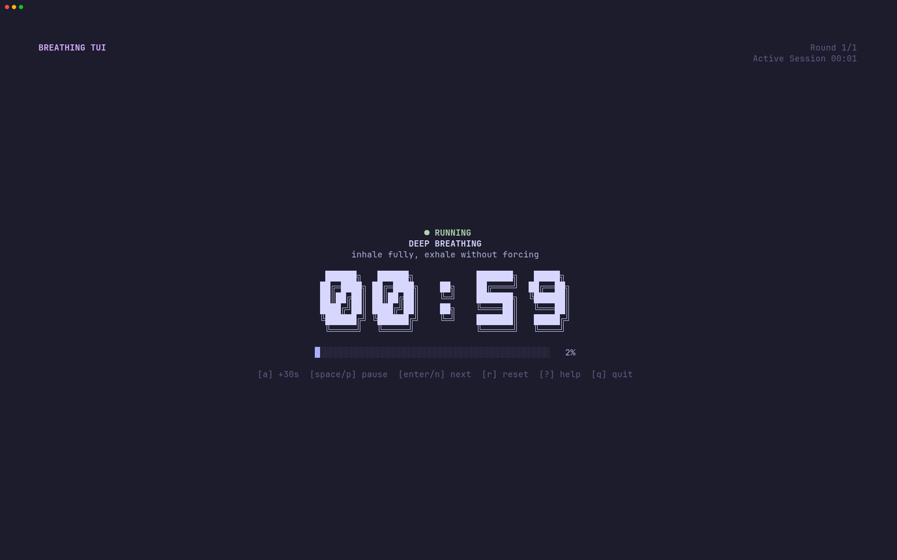
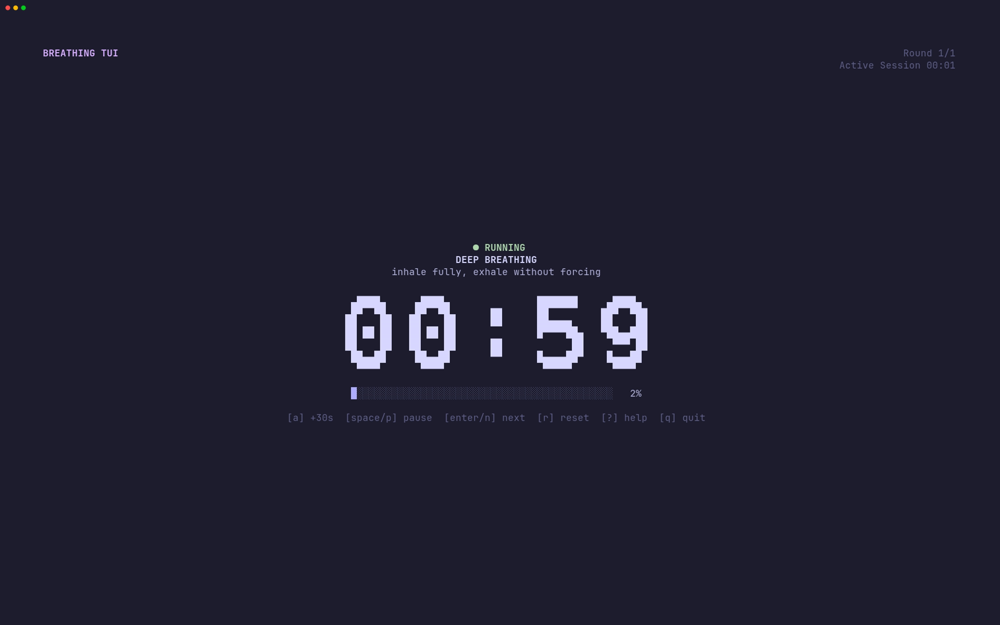
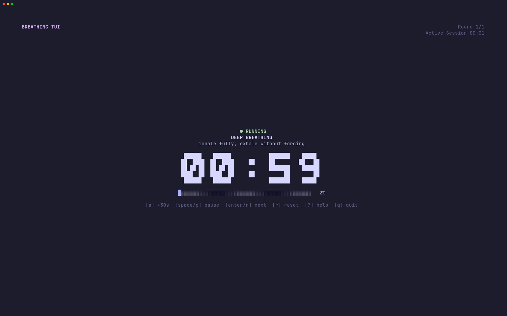
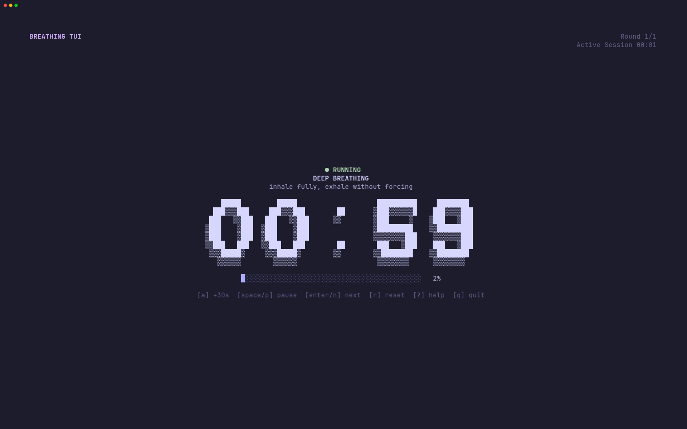

<div align="center">

# Breathing TUI

*A fast, keyboard-first terminal breathing session timer and tracker*

[](https://go.dev/)
[](LICENSE)
[](https://github.com/charmbracelet/bubbletea)
[](https://github.com/charmbracelet/lipgloss)


[Features](#features) • [Installation](#installation) • [Quickstart](#quickstart) • [Breathing Modes](#breathing-modes) • [Controls](#keyboard-controls) • [Statistics & Cleaner](#statistics--session-cleaner) • [Configuration](#configuration) • [Themes](#themes--fonts)

</div>

---

**Breathing TUI** (`breath`) is a lightweight, local-first terminal application designed for multi-round breathing exercises and retention tracking. It guides you through deep breathing, open-ended retention breath-holds, and recovery periods, while persisting your practice to a local SQLite database with actionable insights, habit streaks, and a GitHub-style activity heatmap.

> [!WARNING]
> **Safety Warning:** Breath-hold exercises can cause tingling, dizziness, or loss of consciousness. Always practice in a safe seated or lying position. **NEVER** practice in or near water, while driving, or while operating machinery. This software is purely a timer and habit tracker; it provides no medical advice or health diagnosis. Stop immediately if you feel unwell.

## Features

- **Guided 3-Phase Cycle:**
  1. **Deep Breathing:** Timed countdown or manual breath counting. Inhale deeply, exhale without force.
  2. **Retention:** Open-ended count-up timer after the exhale. Never auto-finishes; ends when you press `Enter`.
  3. **Recovery Hold:** Countdown timer after deep inhalation. Auto-completes at zero.
- **Dual Breathing Modes:** Traditional countdown timer (`--timed`, extendable with `a` for +30s) or breath-counting mode (`--counted`, with `a` for +1, `s` for -1, and anti-key-repeat debounce protection).
- **Animated Typewriter Quotes:** Optional focus or motivational phrases typed out smoothly character-by-character on screen, cycling on a configurable interval (default: 30s).
- **Statistics Dashboard:** A clean, unboxed terminal dashboard featuring a 4-month calendar heatmap with graduated block ramps, a 7-day activity bar chart, retention metrics (average, personal best, latest), streaks, and all-time totals.
- **Session Cleaner:** Built-in pruning tool to purge test runs or accidental sessions using Git-like offsets (`breath clean`, `breath stats clean ~1`, `~2`) or reset entirely (`--all`).
- **Dual Monotonic Clocks:** Central phase clock with large ASCII digit rendering (`ansiShadow`, `mono12`, `ansi`, `rebel`) and continuous session clock. Pausing freezes active timers without clock jump on resume.
- **Incremental Persistence:** Completed rounds and retention times are saved to SQLite immediately upon completion, preventing data loss if interrupted.
- **7 Built-in Themes:** Handcrafted palettes including `pomo`, `catppuccin-mocha`, `dracula`, `gruvbox`, `nord`, `tokyo-night`, `solarized`, and `default`.
- **100% Local & Private:** Zero accounts, telemetry, or network calls. Fully compliant with XDG base directories.

## Inspiration

The terminal interface and statistics dashboard were inspired by [Bahaaio/pomo](https://github.com/Bahaaio/pomo), a customizable Pomodoro timer for the terminal. Breathing TUI adapts those ideas to multi-round breathing sessions.

## Installation

### From Source

Ensure you have [Go 1.22+](https://go.dev/dl/) installed:

```bash
git clone https://github.com/Nerver-zip/breathe.git
cd breathe
make build
# Binary is generated at bin/breath
```

Install globally to your `$GOPATH/bin`:

```bash
go install .
```

## Quickstart

Start a default session (3 rounds, 30s recovery):

```bash
breath start
```

### Quick Commands

```bash
# Breath-counted mode with 30 target breaths per round
breath start --counted 30

# Timed breathing mode with custom durations
breath start --timed --breathing 2m30s --recovery 30s --rounds 4

# Auto-advance to the next round immediately after recovery
breath start --auto-next

# Launch with a specific theme and font
breath start --theme pomo --font ansiShadow
```

## Breathing Modes

| Mode | Flag | Description | Keybindings |
|---|---|---|---|
| **Counted** | `--counted [N]` | Targets a specific breath count (e.g. 30 breaths). Transitions to retention automatically when the target is met. | `a` / `+`: +1 breath<br>`s` / `-`: -1 breath |
| **Timed** | `--timed` | Traditional countdown timer for deep breathing (e.g. 3m). Automatically enters retention at 00:00. | `a` / `+`: +30s bonus time |

> [!TIP]
> In counted mode, the `a` and `s` keys include a hardware debounce window (300ms) to prevent accidental double-counts when holding down keys.

## Keyboard Controls

### Active Session

| Key | Action |
|---|---|
| `Space` / `p` | Pause or resume session clocks |
| `Enter` / `n` | Advance to next phase (end retention, skip recovery) |
| `a` / `+` | Add 1 breath (counted mode) or +30s (timed mode) |
| `s` / `-` | Subtract 1 breath (counted mode only) |
| `r` | Restart current phase (prompts confirmation during retention) |
| `?` | Toggle help overlay and safety reminder |
| `q` / `Esc` | Quit session (prompts confirmation; completed rounds are preserved) |

### Summary & Overlays

| Key | Context | Action |
|---|---|---|
| `Enter` / `q` | Summary Screen | Exit session |
| `s` | Summary Screen | Open full statistics dashboard |
| `y` / `n` | Confirmation Dialog | Confirm (`y`) or cancel (`n` / `Esc`) |
| `q` / `Esc` | Statistics Dashboard | Close dashboard |

## Statistics & Session Cleaner

View your practice statistics in a full-screen terminal dashboard:

```bash
breath stats
```

For shell scripts and automated exports:

```bash
breath stats --plain   # Plain text summary
breath stats --json    # Structured JSON output
```

### Session Cleaner

Prune test sessions or accidental recordings without modifying the database directly:

```bash
# Delete the latest session
breath clean
# or: breath stats clean

# Delete the previous session (~1)
breath clean ~1

# Delete the penultimate session (~2)
breath clean ~2

# Delete all recorded sessions and reset history
breath clean --all
```

## Configuration

Settings are saved automatically in `~/.config/breath/config.yaml` (respects `$XDG_CONFIG_HOME`).

See [`config.example.yaml`](config.example.yaml) for a complete template.

### CLI Configuration Manager

```bash
# View current effective configuration
breath config show

# Print configuration file path
breath config path

# Modify persistent settings
breath config set mode counted
breath config set breaths 30
breath config set recovery 30s
breath config set theme pomo
breath config set font ansiShadow
breath config set quote_interval 30s
breath config set notifications true
breath config set bell true
```

### Typewriter Phrases

Configure focus or mindfulness phrases to appear on screen with an animated typewriter effect during sessions:

```yaml
# ~/.config/breath/config.yaml

quote_interval: 30s
quotes:
  - "Inhale peace, exhale tension."
  - "Trust the rhythm of your breath."
  - "Be present in the stillness."
```

> [!NOTE]
> If `quotes` is empty or omitted, no quote banner or empty space will be displayed.

## Themes & Fonts

### Themes

List and preview built-in color palettes:

```bash
# List all themes
breath theme list

# Preview theme swatches and mock components
breath theme preview pomo
breath theme preview dracula
breath theme preview catppuccin-mocha

# Set the active theme
breath theme set pomo
```

Supported themes: `pomo`, `default`, `catppuccin-mocha`, `dracula`, `gruvbox`, `nord`, `tokyo-night`, `solarized`.

### Digit Fonts

Configure the clock font for the central timer:

| **ansiShadow** (default) | **mono12** |
| :---: | :---: |
|  |  |
| **ansi** | **rebel** |
|  |  |

```bash
breath config set font ansiShadow
```

On compact terminal windows (under 60 columns or 18 rows), the interface gracefully collapses to inline text representation.
